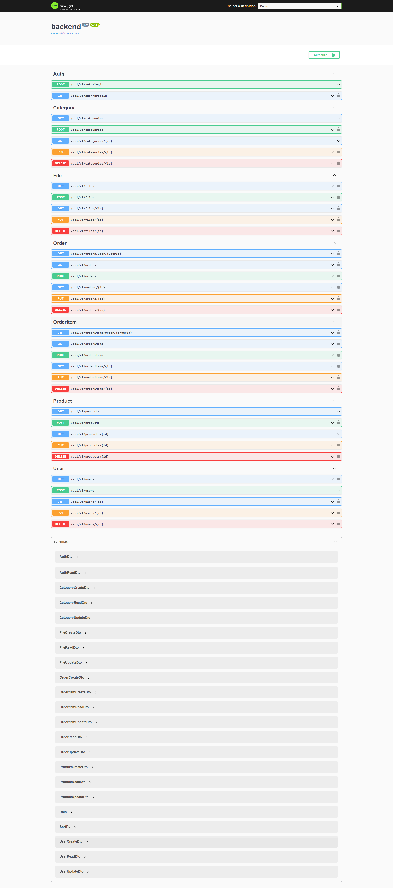
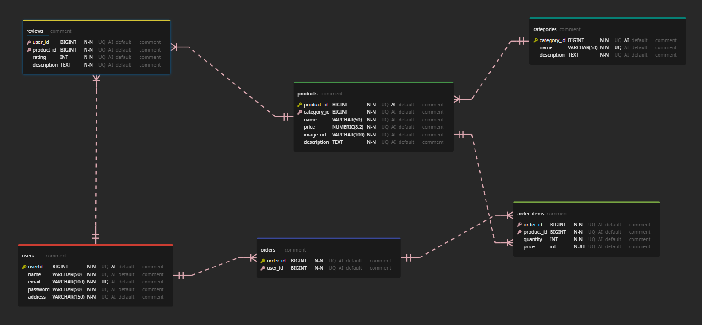

[Go Back to README.md](../README.md)

[Go to API Documentation](APIDocumentation.md)

## Folder/File Structure

```CLEA
.
│   AutoMapperProfile.cs
│   backend.csproj
│   Program.cs
│
└───Authorization
    └───UpdateUserHandler.cs
|
└─── Controllers
    |   AuthController.cs
    |   BaseController.cs
    |   CategoryController.cs
    |   FileController.cs
    |   OrderController.cs
    |   OrderItemController.cs
    |   ProductController.cs
    └───UserController.cs
|
└─── Database
    |   AppDbContextSaveChangesInterceptor.cs
    └───DatabaseContext.cs
|
└─── DTOs
    |   AuthDto.cs
    |   CategoryDTO.cs
    |   FileDto.cs
    |   OrderDTO.cs
    |   OrderItemDTO.cs
    |   ProductDTO.cs
    └───UserDTO.cs
|
└─── Helpers
    |   ServiceException.cs
    └───ServiceHash.cs
|
└─── Models
    |   BaseModel.cs
    |   Category.cs
    |   FileModel.cs
    |   Order.cs
    |   OrderItem.cs
    |   Product.cs
    └───User.cs
|
└─── Properties
    └───launchSettings.cs
|
└─── Repositories
    └─── AuthRepo
        |   AuthRepo.cs
        └─── IAuthRepo.cs
    └─── BaseRepo
        |   BaseRepo.cs
        └─── IBaseRepo.cs
    └─── CategoryRepo
        |   CategoryRepo.cs
        └─── ICategoryRepo.cs
    └─── FileRepo
        |   FileRepo.cs
        └─── IFileRepo.cs
    └─── OrderItemRepo
        |   OrderItemRepo.cs
        └─── IOrderItemRepo.cs
    └─── OrderRepo
        |   OrderRepo.cs
        └─── IOrderRepo.cs
    └─── ProductRepo
        |   ProductRepo.cs
        └─── IProductRepo.cs
    └─── UserRepo
        |   UserRepo.cs
        └─── IUserRepo.cs
|
└─── Services
    └─── AuthService
        |   AuthService.cs
        └─── IAuthService.cs
    └─── BaseService
        |   BaseService.cs
        └─── IBaseService.cs
    └─── CategoryService
        |   CategoryService.cs
        └─── ICategoryService.cs
    └─── FileService
        |   FileService.cs
        └─── IFileService.cs
    └─── OrderItemService
        |   OrderItemService.cs
        └─── IOrderItemService.cs
    └─── OrderService
        |   OrderService.cs
        └─── IOrderService.cs
    └─── ProductService
        |   ProductService.cs
        └─── IProductService.cs
    └─── UserService
        |   UserService.cs
        └─── IUserService.cs
```

## APIs



## API Endpoints

