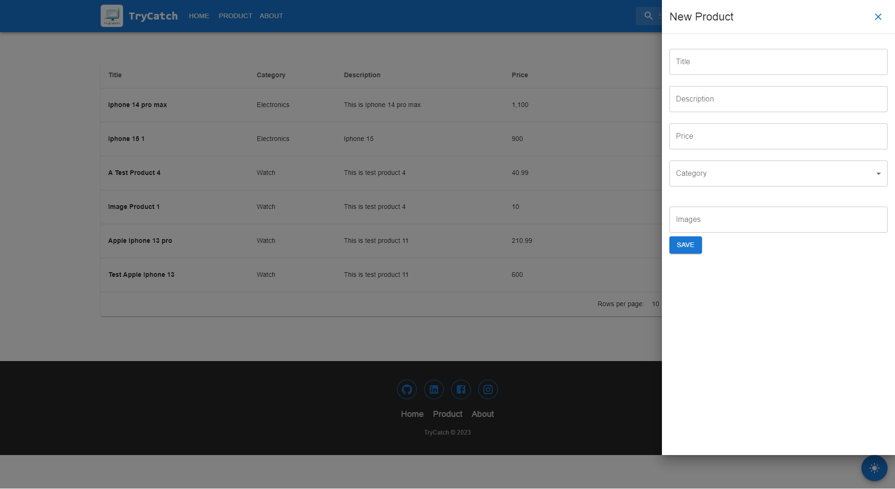

[Go Back to README.md](../README.md)

## Folder/File Structure of `src` Folder

```CLEA
.
│   App.tsx
│   index.tsx
│   reportWebVitals.ts
│   setupTests.ts
│
└───common
    └───axiosInstance.ts
|
└───components
    └───auth
        |   Signin.tsx
        └───Signup.tsx
    |
    └───cart
        └───DrawerCart.tsx
    |
    └───footer
        └───Footer.tsx
    |
    └───header
        └───Header.tsx
    |
    └───home
        |   HomeSlider.tsx
        └───NewProducts.tsx
    |
    └───product
        |   AddToCartButton.tsx
        |   ProductAddDrawer.tsx
        |   ProductBox.tsx
        |   ProductEditDrawer.tsx
        └───ProductSideFilter.tsx
|
└───hooks
    └───reduxHook.ts
|
└───pages
    |   Cart.tsx
    |   Home.tsx
    |   NotFound.tsx
    |   ProductDetail.tsx
    |   ProductList.tsx
    |   Products.tsx
    |   Profile.tsx
    └───Root.tsx
|
└───redux
    |   store.ts
    └───methods
        |   cartMethods.ts
        └───productMethods.ts
    |
    └───reducers
        |   cartReducer.ts
        |   categoryReducer.ts
        |   productReducer.ts
        └───userReducer.ts
|
└───routes
    |   ProtectedRoute.tsx
    └───ProtectedRouteAdmin.tsx
|
└───styles
    └───style.scss
|
└───types
    |   cart.ts
    |   category.ts
    |   error.ts
    |   product.ts
    └───user.ts
|
└─── validations
    |   loginSchema.ts
    |   productSchema.ts
    └───registrationSchema.ts
```

## Screenshots

#### `Home`


#### `Signup`


#### `Signin`


#### `Products`


#### `Products filter`


#### `Sidebar Cart`


#### `Cart`


#### `Admin - Product List`


#### `Admin - Add Product`



#### `Admin - Edit Product`


#### `Dark Theme`


